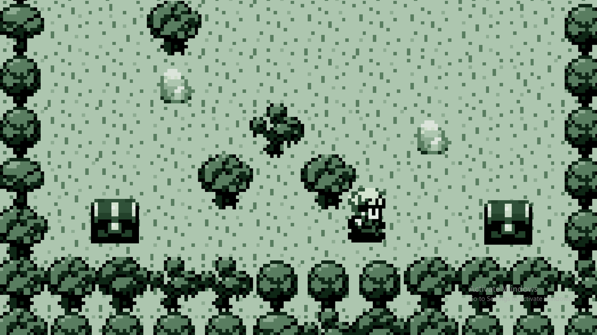

# Evolution's Parable: A game that evolves with your progress

For my first ever Unity project, I coded a game that evolves in graphics, features, and even game style.  

---
# Acknowledgement and Background

This short game was inspired by a much more polished game called "Evoland". I had already played both Evoland and Evoland 2. For my Game Programming course I had to create a short game, and I thought I'd recreate something close to it.

# Assets
I needed sprites for characters, animation, objects, etc. I also needed tilemaps and other graphics. So since this was just a demo project, I decided to get all my assets from the game I based my short game on.
I already covered my adventure in un-PAK-ing (wink) Evoland's assets in another [**repo**](https://github.com/JamilHaidar/PAK-unpacker).

# The Game
First the game starts with a generic main menu (with a hidden button) and nice background music.

Starting a new game puts the player in a world where they can only go left. After getting the chest on the left, they'll get the ability to move right. Then, they get 2D movement. The game advances as achievements are unlocked.

These achievements include camera scroll, camera following, a background music, sound effects, a sword for clearing bushes and killing enemies, etc.

After the enemies are killed, a portal shows up to teleport the player to the overworld.

The player is teleported to the overworld where walking triggers fights similar to the Pokemon games.

The fights progress as the player levels up and wanders into different parts of the map.

If the player's HP hits 0, it's game over.

And finally, the game is won after defeating the boss.

---
# Final Notes
This project was a fairly simple one. I finished it in 3 sittings as it was my first "game". I had fun learning about Tiles and Tilemaps. I also expanded on my experience with handling files as explained in the [**Assets**](#assets) section. I learned about loading and unloading scenes efficiently, passing parameters between scenes, and handling audio. All other scripts such as interactions, movement, ray-casting, and particle effects were fairly simple. 
I have included in this repo the compiled version of the game as well as some recordings and a powerpoint slideshow presentation.
